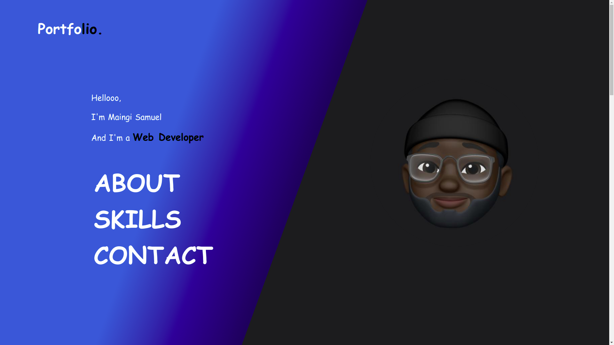

# Maingi Portfolio

#### Created on 2nd April 2021
#### By Samuel Maingi Mutunga

## Description 
This a Website that show case my skills and abilities I have. A little Description about the Handsome Man behind all this beautiful Code. You can reach me easily via the Contact Section on the Website am also 24/7 available. If you ever need me will be there `5:30 am To 9:00 pm`

The landing Page

---

## Access the website
Need the latest browser to be able to View

Follow this link https://layersony.github.io/portfolio/

It is hosted by github.

---

### Setup
To access this project on your local files, you can clone it using these steps
1. Open your terminal
1. Use this command to clone `$ git clone https://github.com/layersony/portfolio.git`
1. This will clone the repositoty into your local folder
1. __Enjoy :)__

## Technologies Used
HTML

CSS

Git

---

## Contact Details
sammaingi5@gmail.com

@Maingi `Slack Moringa`

---

### License
This Project is under the [MIT](LICENCE) license